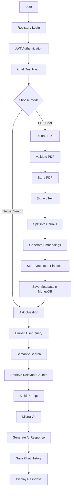
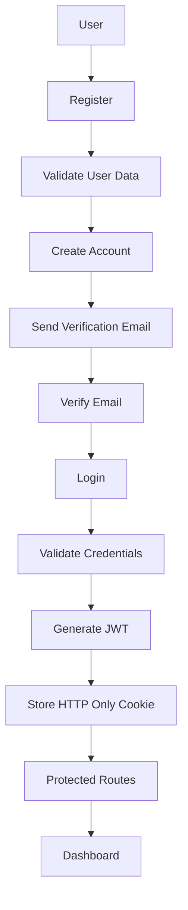
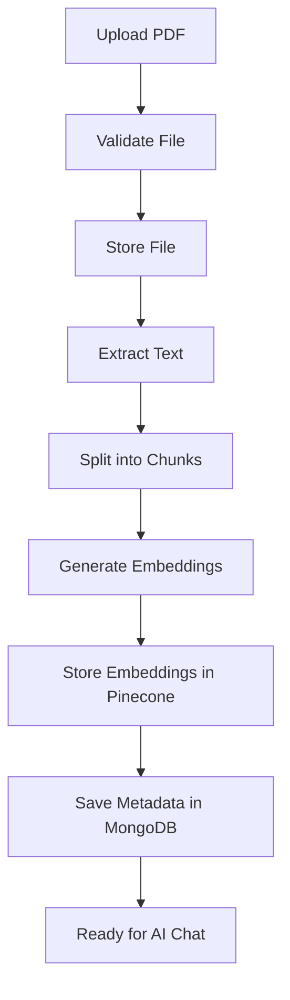
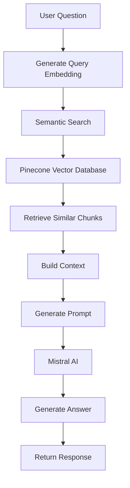
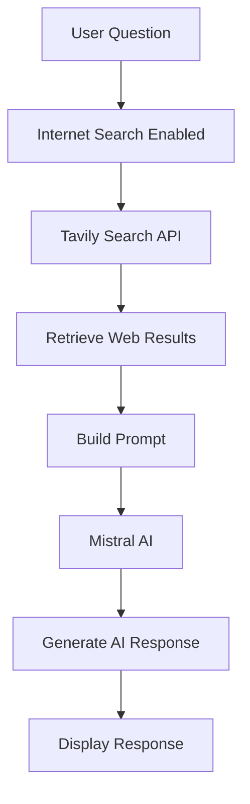
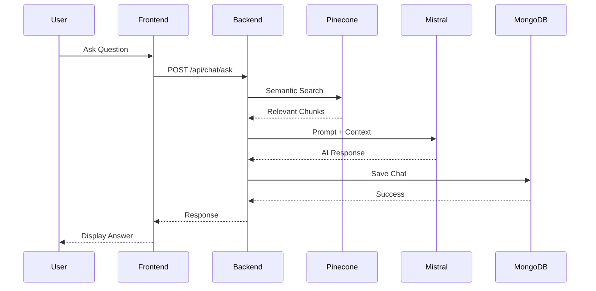
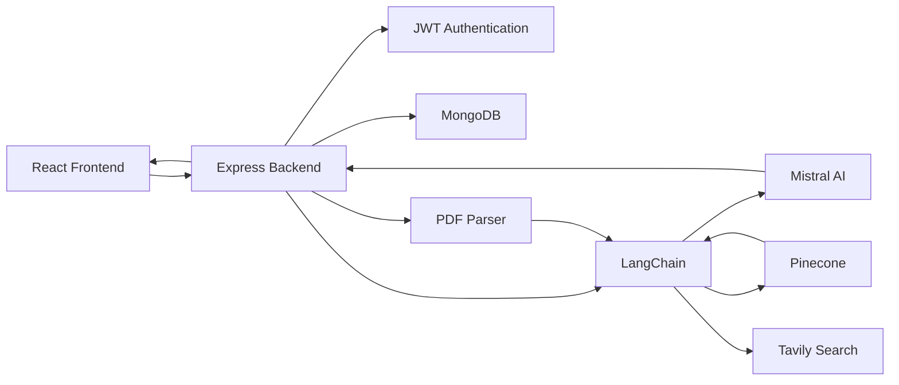
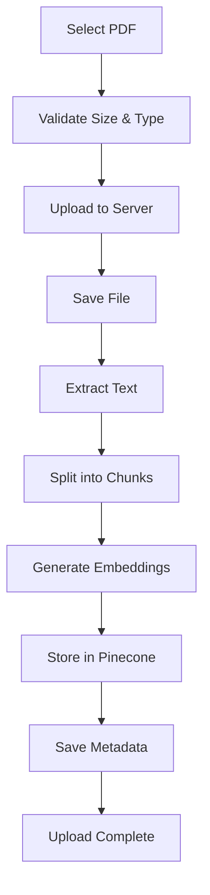
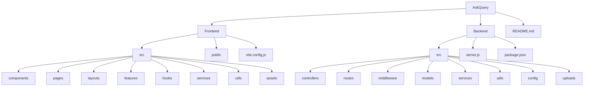

AskQuery – AI Document Assistant using RAG
AskQuery is a full-stack AI-powered document assistant that allows users to upload PDF documents and interact with them using Retrieval-Augmented Generation (RAG). The application combines semantic search, vector embeddings, large language models, and internet search to generate accurate, context-aware responses while maintaining secure authentication and persistent chat history

<div align="center">


</div>


## ✨ Features

- Secure JWT Authentication
- Email Verification using Gmail OAuth2
- PDF Upload & Management
- Retrieval-Augmented Generation (RAG)
- Semantic Search with Pinecone
- Mistral Embeddings
- LangChain Pipeline
- Internet Search (Tavily)
- Persistent Chat History
- Markdown Rendering
- Mathematical Formula Rendering (KaTeX)
- Syntax Highlighting
- Responsive UI

## 🛠️ Tech Stack

### **Frontend**

- **Framework:** React 19, React Router DOM
- **State Management:** Redux Toolkit
- **Styling:** Tailwind CSS
- **Networking:** Axios
- **Markdown Rendering:** React Markdown
- **Math Rendering:** KaTeX, remark-math, rehype-katex
- **Code Highlighting:** React Syntax Highlighter
- **Notifications:** React Hot Toast
- **Icons:** Lucide React
- **Build Tool:** Vite

### **Backend**

- **Runtime:** Node.js, Express.js
- **Database:** MongoDB, Mongoose
- **Authentication:** JWT, HTTP-Only Cookies
- **Email Service:** Nodemailer (Gmail OAuth2)
- **File Upload:** Multer
- **Validation:** Validator
- **Security:** CORS, Cookie Parser, Express Rate Limit
- **Environment Management:** dotenv

### **AI & RAG Pipeline**

- **Framework:** LangChain
- **LLM:** Mistral AI
- **Embedding Model:** Mistral Embeddings
- **Vector Database:** Pinecone
- **Document Parsing:** pdf-parse
- **Text Splitting:** RecursiveCharacterTextSplitter
- **Internet Search:** Tavily Search API

### **Development Tools**

- **Version Control:** Git, GitHub
- **Package Manager:** npm
- **API Testing:** Postman

## 🔄 Workflow Diagrams


## 🏗️ Application Workflow


- **Code Editor:** Visual Studio Code

- ## 🔐 Authentication Flow



## 📄 PDF Processing Workflow



## 🤖 RAG Pipeline



## 🌐 Internet Search Workflow



## 💬 Chat Request Flow



## 🏛️ System Architecture



## 🗂️ Document Upload Flow



## 📂 Project Structure



## 🚀 Installation

### 1. Clone the repository

```bash
git clone https://github.com/hari5827/AskQuery-Genai.git
```

### 2. Install Backend Dependencies

```bash
cd backend
npm install
```

### 3. Install Frontend Dependencies

```bash
cd ../frontend
npm install
```

### 4. Configure Environment Variables

Create a `.env` file inside the backend directory.

### 5. Start Backend

```bash
npm run dev
```

### 6. Start Frontend

```bash
npm run dev
```

## 🔑 Environment Variables

Create a `.env` file inside the **backend** folder.

```env
PORT=

MONGO_URI=

JWT_SECRET=

GOOGLE_CLIENT_ID=

GOOGLE_CLIENT_SECRET=

GOOGLE_REFRESH_TOKEN=

GOOGLE_EMAIL=

MISTRAL_API_KEY=

PINECONE_API_KEY=

TAVILY_API_KEY=
```

## 📡 API Endpoints

### Authentication

| Method | Endpoint |
|--------|----------|
| POST | `/api/auth/register` |
| POST | `/api/auth/login` |
| POST | `/api/auth/logout` |
| GET | `/api/auth/me` |
| POST | `/api/auth/verify-email` |

### PDF

| Method | Endpoint |
|--------|----------|
| POST | `/api/pdf/upload` |
| GET | `/api/pdf` |
| DELETE | `/api/pdf/:id` |

### Chat

| Method | Endpoint |
|--------|----------|
| POST | `/api/chat/ask` |
| GET | `/api/chat/history` |
| DELETE | `/api/chat/:id` |

## 🚀 Upcoming Features

- [x] Streaming AI Responses
- [ ] YouTube Video Q&A
- [ ] Redis Caching

## 📄 License

This project is licensed under the MIT License.

## 👨‍💻 Author

**Hariom Mishra**

- GitHub: https://github.com/hari5827
- LinkedIn: https://www.linkedin.com/in/hariom-mishra-b0880b255/

  ## ⭐ Support

If you found this project helpful, consider giving it a ⭐ on GitHub.
It helps others discover the project and supports future development.
