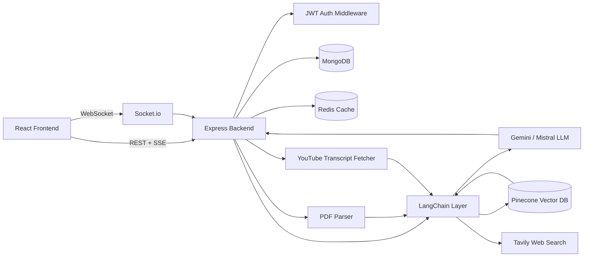
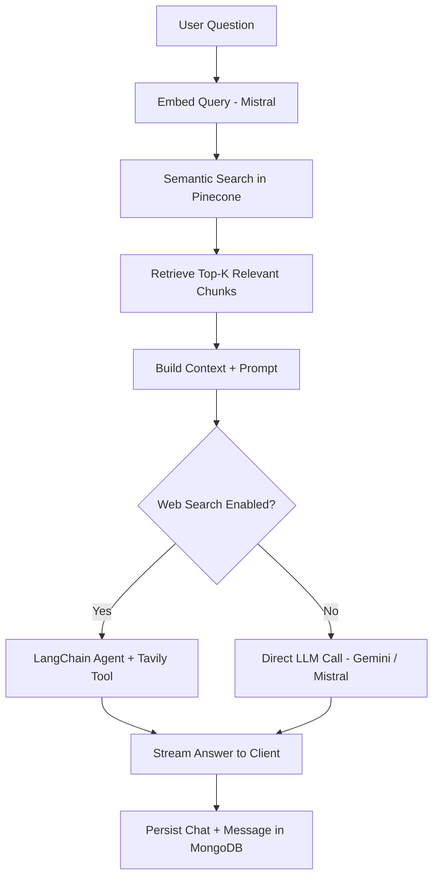
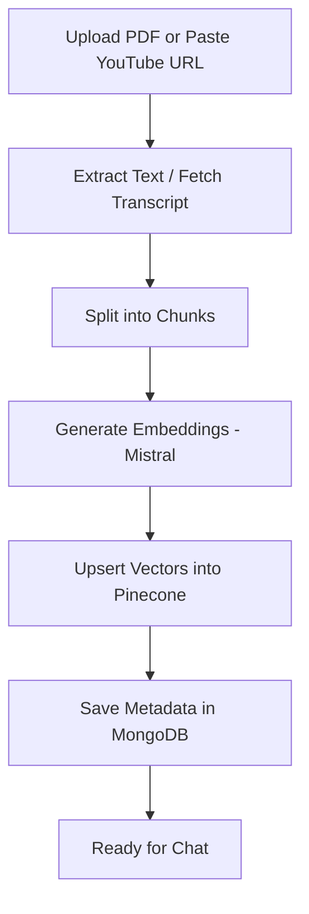
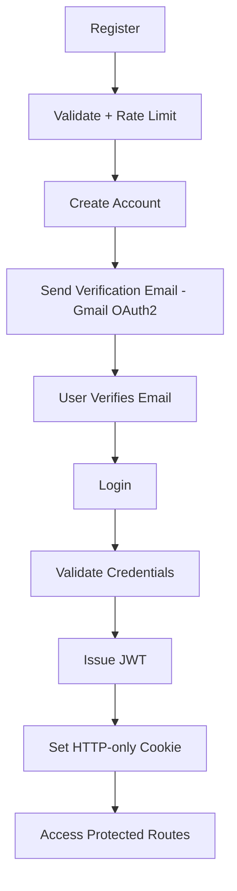

<div align="center">

# 📚 AskQuery — AI Document & Video Assistant (RAG)

**Chat with your PDFs, YouTube videos, and the live web - powered by Retrieval-Augmented Generation.**


</div>

---

## 🧠 What is AskQuery?

AskQuery is a full-stack, production-style RAG (Retrieval-Augmented Generation) application. Users can:

- Upload a **PDF** and ask questions about its content
- Paste a **YouTube link** and ask questions about the video (via its transcript)
- Toggle **live internet search** to get answers grounded in current web results
- Chat in real time, with **token-by-token streaming responses**

Under the hood, the app chunks and embeds source content, stores the vectors in **Pinecone**, retrieves the most relevant chunks for a given question, and hands them to an LLM (**Gemini** or **Mistral**) — orchestrated with **LangChain** — to produce a grounded, cited answer. A LangChain **agent with a web-search tool** (Tavily) is used when internet mode is enabled, and **Redis** caches repeated searches/answers to cut latency and API cost.

---

## ✨ Features

- 🔐 **Secure authentication** — JWT stored in HTTP-only cookies, with rate-limited login/register endpoints
- 📧 **Email verification** — Gmail OAuth2 via Nodemailer, with a resend-verification flow
- 📄 **PDF upload & RAG chat** — parse, chunk, embed, and semantically search PDF content
- ▶️ **YouTube Q&A** — drop in a video URL and chat with its transcript, using the same RAG pipeline
- 🌐 **Live internet search mode** — a LangChain agent calls a Tavily search tool for up-to-date, non-document questions
- ⚡ **Streaming responses** — answers stream back token-by-token over Server-Sent Events / Socket.io instead of waiting for the full response
- 🧵 **Persistent chat history** — every conversation and message is saved per user in MongoDB, with auto-generated chat titles
- 🚀 **Redis caching** — caches web-search results and repeated queries to reduce latency and third-party API usage
- 🛡️ **Rate limiting** — dedicated limiters for login, register, upload, and ask endpoints to prevent abuse
- 📝 **Rich message rendering** — Markdown, syntax-highlighted code blocks, and KaTeX-rendered math in the UI
- 🗑️ **Full account/document/chat management** — delete individual documents, chats, or the whole account
- 📱 **Responsive UI** built with React 19, Redux Toolkit, and Tailwind CSS

---

## 🛠️ Tech Stack

### Frontend
| Category | Tech |
|---|---|
| Framework | React 19, React Router |
| State management | Redux Toolkit |
| Styling | Tailwind CSS |
| Networking | Axios, Socket.io Client |
| Markdown / Math / Code | react-markdown, remark-gfm, remark-math, rehype-katex (KaTeX), react-syntax-highlighter |
| Notifications | React Hot Toast |
| Icons | Lucide React |
| Build tool | Vite |

### Backend
| Category | Tech |
|---|---|
| Runtime | Node.js, Express.js |
| Real-time | Socket.io |
| Database | MongoDB + Mongoose |
| Cache | Redis (ioredis) |
| Auth | JWT, HTTP-only cookies, custom auth middleware |
| Email | Nodemailer with Gmail OAuth2 |
| File upload | Multer |
| Validation | validator |
| Security | CORS, cookie-parser, express-rate-limit |
| Logging | Morgan |

### AI / RAG Pipeline
| Category | Tech |
|---|---|
| Orchestration | LangChain (`langchain`, `@langchain/core`) |
| LLMs | Google Gemini (`@langchain/google-genai`), Mistral AI (`@langchain/mistralai`) |
| Embeddings | Mistral Embeddings (`mistral-embed`) |
| Vector database | Pinecone |
| Agent tools | Custom `searchInternet` tool backed by Tavily Search API |
| PDF parsing | `pdf-parse` |
| YouTube transcripts | `youtube-transcript` |
| Chunking | LangChain `RecursiveCharacterTextSplitter` |
| Schema validation | Zod |

---

## 🏛️ System Architecture


```mermaid
flowchart LR
    A[React Frontend] -->|REST + SSE| B[Express Backend]
    A -->|WebSocket| S[Socket.io]
    B --> C[JWT Auth Middleware]
    B --> D[(MongoDB)]
    B --> R[(Redis Cache)]
    B --> E[LangChain Layer]
    E --> F[Gemini / Mistral LLM]
    E --> G[(Pinecone Vector DB)]
    E --> H[Tavily Web Search]
    B --> I[PDF Parser]
    B --> Y[YouTube Transcript Fetcher]
    I --> E
    Y --> E
    G --> E
    F --> B
    S --> B
```

## 🤖 RAG Query Flow


```mermaid
flowchart TD
    A[User Question] --> B[Embed Query - Mistral]
    B --> C[Semantic Search in Pinecone]
    C --> D[Retrieve Top-K Relevant Chunks]
    D --> E[Build Context + Prompt]
    E --> F{Web Search Enabled?}
    F -->|Yes| G[LangChain Agent + Tavily Tool]
    F -->|No| H[Direct LLM Call - Gemini / Mistral]
    G --> I[Stream Answer to Client]
    H --> I
    I --> J[Persist Chat + Message in MongoDB]
```

## 📄 Document / Video Ingestion Flow


```mermaid
flowchart TD
    A[Upload PDF or Paste YouTube URL] --> B[Extract Text / Fetch Transcript]
    B --> C[Split into Chunks]
    C --> D[Generate Embeddings - Mistral]
    D --> E[Upsert Vectors into Pinecone]
    E --> F[Save Metadata in MongoDB]
    F --> G[Ready for Chat]
```

## 🔐 Authentication Flow


```mermaid
flowchart TD
    A[Register] --> B[Validate + Rate Limit]
    B --> C[Create Account]
    C --> D[Send Verification Email - Gmail OAuth2]
    D --> E[User Verifies Email]
    E --> F[Login]
    F --> G[Validate Credentials]
    G --> H[Issue JWT]
    H --> I[Set HTTP-only Cookie]
    I --> J[Access Protected Routes]
```

---

## 📂 Project Structure

```
AskQuery-Genai/
├── frontend/
│   ├── src/
│   │   ├── app/                 # App shell, routes, store, global CSS
│   │   └── features/
│   │       ├── auth/            # Login/Register pages, auth slice & API
│   │       ├── chat/            # Chat UI, socket service, chat slice
│   │       └── pdf/             # Document upload/list, pdf slice
│   ├── public/
│   └── vite.config.js
│
└── backend/
    ├── server.js                # Entry point (HTTP server + Socket.io)
    └── src/
        ├── app.js               # Express app & route mounting
        ├── config/               # MongoDB, Redis, Pinecone config
        ├── controllers/          # auth, chat, pdf, youtube controllers
        ├── middleware/           # auth, upload (Multer), rate limiting
        ├── models/                # User, Chat, Message, Document (Mongoose)
        ├── routes/                # /api/auth, /api/chats, /api/pdf, /api/youtube
        ├── services/              # ai, rag, embedding, vector, internet, cache, pdf, youtube, mail
        ├── sockets/               # Socket.io server setup
        ├── utils/                 # prompt builder, document splitter
        └── validator/             # request validation
```

---

## 🚀 Getting Started

### Prerequisites
- Node.js (v18+ recommended)
- MongoDB instance (local or Atlas)
- Redis instance (local or hosted, e.g. Upstash/Redis Cloud)
- API keys for: Google Gemini, Mistral AI, Pinecone, Tavily
- A Google account configured for Gmail OAuth2 (for verification emails)

### 1. Clone the repository
```bash
git clone https://github.com/hari5827/AskQuery-Genai.git
cd AskQuery-Genai
```

### 2. Backend setup
```bash
cd backend
npm install
```
Create a `.env` file inside `backend/` (see [Environment Variables](#-environment-variables) below), then start the server:
```bash
npm run dev
```

### 3. Frontend setup
```bash
cd ../frontend
npm install
npm run dev
```

The frontend runs on Vite's default dev server, and the backend listens on the port set by `PORT` in your `.env`.

---

## 🔑 Environment Variables

Create a `.env` file inside the **backend** folder:

```env
# Server
PORT=3000
NODE_ENV=development

# Database & Cache
mongo_uri=your_mongodb_connection_string
REDIS_URL=redis://localhost:6379

# Auth
JWT_SECRET=your_jwt_secret

# Gmail OAuth2 (for verification emails)
GOOGLE_CLIENT_ID=
GOOGLE_CLIENT_SECRET=
GOOGLE_REFRESH_TOKEN=
GOOGLE_USER=

# AI / Vector / Search providers
ASKQUERY_API_KEY=       # Google Gemini API key
MISTRAL_API_KEY=
PINECONE_API_KEY=
TAVILY_API_KEY=
```

> **Note:** In Pinecone, create an index named `askquery` before running the app (see `backend/src/config/pinecone.js`).

---

## 📡 API Reference

### Auth — `/api/auth`
| Method | Endpoint | Description |
|---|---|---|
| POST | `/register` | Create a new account (rate-limited) |
| POST | `/login` | Log in, receive JWT cookie (rate-limited) |
| GET | `/verify-email` | Verify email via emailed link/token |
| POST | `/resend-verification` | Resend the verification email |
| GET | `/get-me` | Get the current authenticated user |
| POST | `/logout` | Clear auth cookie |
| DELETE | `/delete-account` | Permanently delete the account |

### Chat — `/api/chats`
| Method | Endpoint | Description |
|---|---|---|
| POST | `/message` | Send a message, get a full response |
| POST | `/message/stream` | Send a message, get a streamed (SSE) response |
| GET | `/` | List all chats for the current user |
| GET | `/:chatId/messages` | Get all messages in a chat |
| DELETE | `/delete/:chatId` | Delete a chat |

### PDF / Documents — `/api/pdf`
| Method | Endpoint | Description |
|---|---|---|
| POST | `/upload` | Upload a PDF (max 10 MB), chunk + embed + store in Pinecone |
| POST | `/ask` | Ask a question about an uploaded document |
| POST | `/ask/stream` | Streamed version of `/ask` |
| GET | `/documents` | List all uploaded documents |
| DELETE | `/:documentId` | Delete a document and its vectors |

### YouTube — `/api/youtube`
| Method | Endpoint | Description |
|---|---|---|
| POST | `/add` | Submit a YouTube URL; transcript is fetched, chunked, and embedded |

All routes above (except register/login/verify) require authentication via the `authUser` middleware, and upload/ask/auth routes are protected by dedicated rate limiters.

---

## 🗺️ Roadmap

- [x] Streaming AI responses (SSE + Socket.io)
- [x] YouTube video Q&A
- [x] Redis caching layer


---

## 📄 License

This project is licensed under the MIT License.

## 👨‍💻 Author

**Hariom Mishra**
- GitHub: [@hari5827](https://github.com/hari5827)
- LinkedIn: [hariom-mishra](https://www.linkedin.com/in/hariom-mishra-b0880b255/)

- **PROJECT WORKING DEMO**

- **PDF UPLOAD RAG & AI STREAMING**
  
https://github.com/user-attachments/assets/979e1fd5-a1f9-40b5-ba13-ddb96ad632cc

-**YOUTUBE LINK Q&A USING RAG**

https://github.com/user-attachments/assets/ac93df8a-cc69-4ca7-b27a-8447bac11620

-**TAVILY OFF INTERNET SEARCH RESPONSE**

https://github.com/user-attachments/assets/20e91264-ce64-40fc-98e6-ff196953777a

-**WEB SEARCH ON USING TAVILY**

https://github.com/user-attachments/assets/36f8b2a6-dbcc-4163-96e8-070ccd9298a0

-**SYNTAX HIGHLIGHTING**

https://github.com/user-attachments/assets/0ebdfcb2-8475-4219-b137-94b7c6b05e1b


## ⭐ Support

If you found this project useful, please consider giving it a ⭐ on GitHub — it helps others discover it and supports future development.
